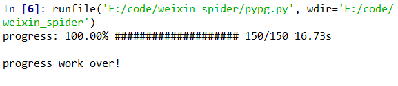

# 工作进度条

工作进度条可以应用到很多场景，下载文件，爬虫，文件批量处理等。

## 使用方法：

将 pypg.py 放置你的项目相同路径下

```
from pypg import PyProgress

total = 150
p = PyProgress(total, isIpy=True)
for i in range(total+1):
        time.sleep(0.1)
        p.update(i)
```

## 应用场景

```
pg = PyProgress(len(data), delay=0)
for k, row in enumerate(data):
    content_url = row[3]
    content = get_content(content_url)
    if not content:
        print('failed connect url: {}'.format(content_url))
    row.append(content)
    pg.update(k)
```

## 运行结果：


## download.py

利用 pypg.py 写的一个媒体文件下载小工具

